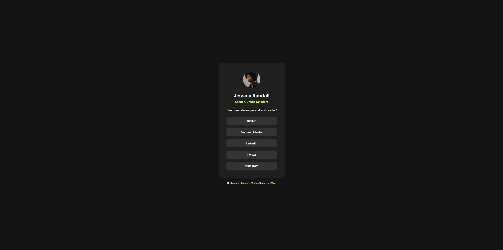

# Frontend Mentor - Social links profile solution

This is a solution to the [Social links profile challenge on Frontend Mentor](https://www.frontendmentor.io/challenges/social-links-profile-UG32l9m6dQ). Frontend Mentor challenges help you improve your coding skills by building realistic projects.

## Table of contents
- [Overview](#overview)
  - [The challenge](#the-challenge)
  - [Screenshot](#screenshot)
  - [Links](#links)
- [My process](#my-process)
  - [Built with](#built-with)
  - [Steps I followed](#steps-i-followed)
  - [What I learned](#what-i-learned)
  - [Continued development](#continued-development)
  - [Useful resources](#useful-resources)
- [Author](#author)
- [Acknowledgments](#acknowledgments)

## Overview
### The challenge
Users should be able to see hover and focus states for all interactive elements on the page and the design should perfectly match the supplied preview image.

### Screenshot

### Links
- Solution URL: [Add solution URL here]
- Live Site URL: [Add live site URL here]

## My process
### Built with
- Semantic HTML5 markup
- CSS custom properties
- Flexbox
- Mobile-first workflow

### Steps I followed
- First, I analyzed the [preview.jpg](./preview.jpg) image and the [style-guide.md](./style-guide.md) to understand the exact layout, colors, and typography required for the challenge.
- I created the base structure in [index.html](./index.html) using semantic HTML elements including main for the card and footer for the attribution.
- The profile card was centered on the page using CSS flexbox, following best practices for vertical and horizontal centering.
- Styles were written in a new style.css file, strictly following the color palette, font sizes, border-radii, and spacing values from the [style-guide.md](./style-guide.md).
- Interactive states for buttons (hover effects) were implemented using CSS transitions and color changes, matching the design specs and accessibility guidelines.
- Responsive design was ensured with media queries so the layout adapts to mobile and desktop screen sizes.
- A bug where the footer appeared next to the card was fixed by restructuring the flex container: switched to flex-direction column, applied space-between, and kept the footer outside the main content block.

### What I learned
- How to closely follow a style guide and pixel-perfect design from a preview image.
- The importance of separating the footer from main content when using flex layouts so it's consistently placed at the bottom of the viewport.

### Continued development
- Adding further responsive improvements for extra-large or very small screens.

### Useful resources
- [MDN Flexbox Guide](https://developer.mozilla.org/en-US/docs/Web/CSS/CSS_Flexible_Box_Layout/Basic_Concepts_of_Flexbox) - Used to center elements and organize the card and footer layout.
- [Frontend Mentor Style Guide](https://www.frontendmentor.io/challenges/social-links-profile-UG32l9m6dQ) - Provided essential colors, fonts, and spacing rules.

## Author
- Frontend Mentor - [@zMyogg](https://www.frontendmentor.io/profile/zMyogg)
- Twitter - [@zMyo_gg](https://x.com/zMyo_gg)

## Acknowledgments
Thanks to the Frontend Mentor community for their design resources.